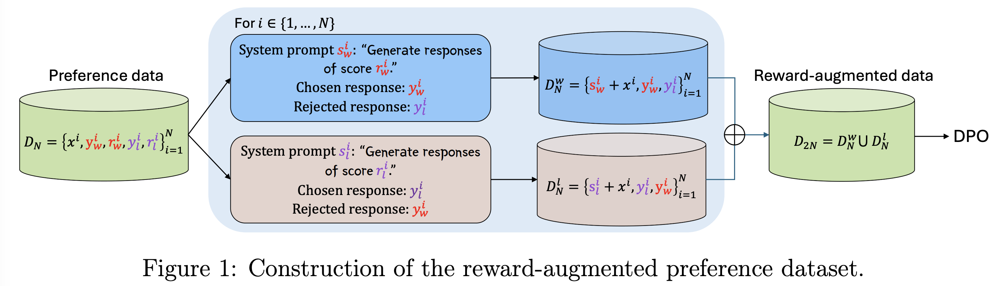
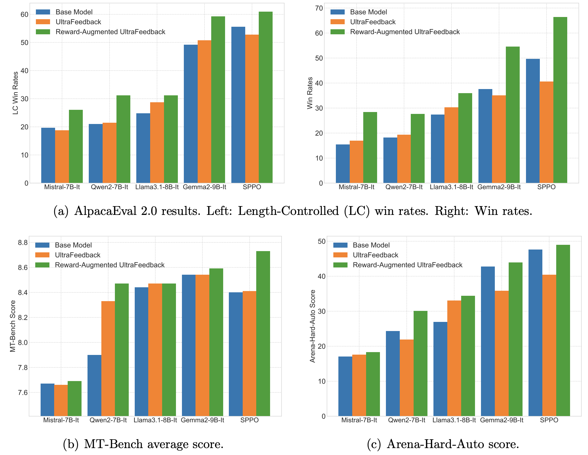

# Reward-Augmented Data Enhances Direct Preference Alignment of LLMs

Code for [Reward-Augmented Data Enhances Direct Preference Alignment of LLMs](https://shenao-zhang.github.io/).

Authors: [Shenao Zhang](https://shenao-zhang.github.io)¹, Zhihan Liu¹, Boyi Liu², Yufeng Zhang, Yingxiang Yang², Yongfei Liu², Liyu Chen², Tao Sun², [Zhaoran Wang](https://zhaoranwang.github.io)¹.

¹Northwestern University,  ²ByteDance

### ⚡ Augment Preference Data with Zero Cost — No Need to Change Algorithms! ⚡

#### How it works: 
#### Performance:

## Installation 

Install the package dependencies as follows:

```shell
 python -m pip install .
```

To fine-tune [Gemma-2-9b-it](https://huggingface.co/google/gemma-2-9b-it), upgrade transformers by `pip install --upgrade transformers`.

## Preference Data Augmentation
Replace `USERNAME` in `scripts/preprocess.py` and `scripts/reward_augmentation.py` with your huggingface username.

First, preprocess the UltraFeedback dataset following [this script](https://huggingface.co/datasets/HuggingFaceH4/ultrafeedback_binarized), while keeping the quality scores of the responses:

```shell
python scripts/preprocess.py
```
Then the reward-augmented preference data can be obtained by running:

```shell
python scripts/reward_augmentation.py
```

## DPO Training

Replace `USERNAME` in `config_full.yaml` with your huggingface username.

Then run standard DPO on the reward-augmented preference data, e.g., on the [Qwen2-7B-Instruct](https://huggingface.co/Qwen/Qwen2-7B-Instruct) model:

```shell
ACCELERATE_LOG_LEVEL=info accelerate launch --config_file recipes/accelerate_configs/deepspeed_zero3.yaml scripts/run_dpo.py recipes/qwen2-7b-instruct-dpo-ra/dpo/config_full.yaml
```

## Acknowledgement
This repo is built upon [The Alignment Handbook](https://github.com/huggingface/alignment-handbook). We thank the authors for their great work. 
